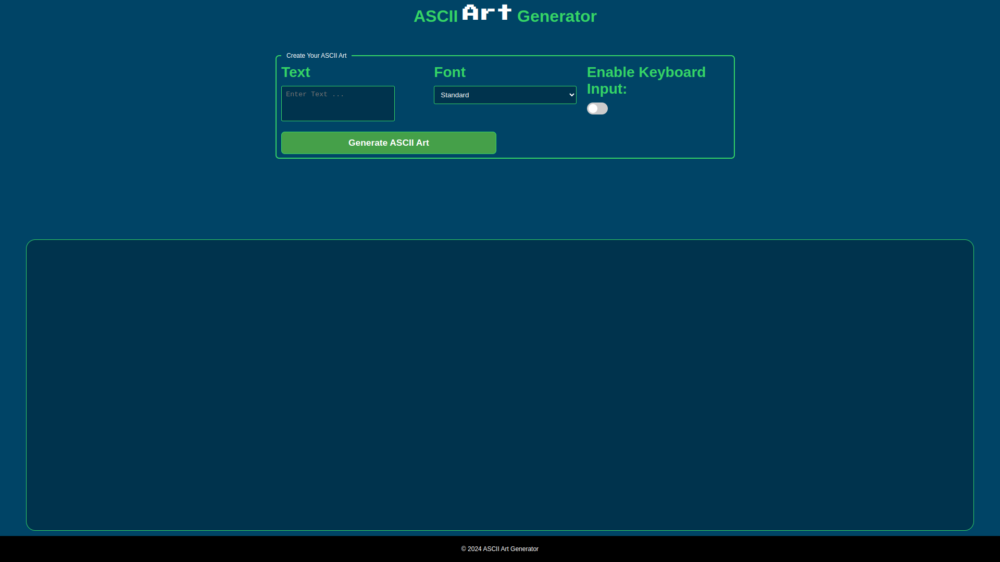
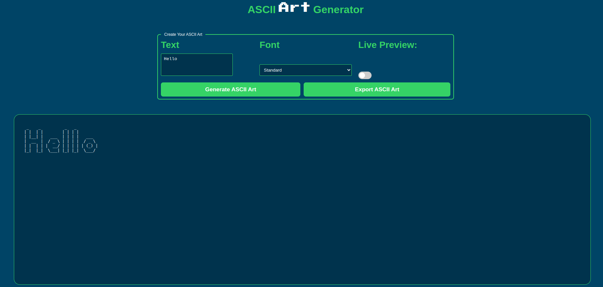

# Export-File

## Project Description

Ascii-art-web-export-file is an improvement of ASCII-Art-Web-Stylize designed to make sure that it is possible to export the output of the web application, at least in one export format at ones choice, with the right permission to read and write. It inherits all the properties of stylize which aims at enhancing the user experience by making a website more appealing, interactive, and intuitive. This project integrates various modern web technologies and practices to ensure that the website is user-friendly, responsive, and provides comprehensive feedback to users.

### Objectives

Ascii-art-web-export-file focuses on providing a funcionality do downlaod a file containing the art created. In addition, a user-friendly and visually appealing website that incorporates the following features:

- Improved interactivity and intuitiveness.
- Enhanced user-friendliness.
- Increased feedback to users.

### Key Learning Outcomes

- The basics of human-computer interaction.
- The fundamentals of CSS and Js
- Linking CSS, HTML and Js.
<!-- TABLE OF CONTENTS -->
<details>
  <summary style="font-weight: bold; font-size: 1.4em;" >Table of Contents</summary>
  <ol>
    <li>
      <a href="#implementation-details">Implementation details</a>
      <ul>
        <li><a href="#built-with">Built With</a></li>
      </ul>
    </li>
    <li>
      <a href="#getting-started">Getting Started</a>
      <ul>
        <li><a href="#prerequisites">Prerequisites</a></li>
        <li><a href="#installation">Installation</a></li>
      </ul>
    </li>
    <li><a href="#usage">Usage</a></li>
    <li><a href="#optional-styles">Optional Styles</a></li>
    <li><a href="#roadmap">Roadmap</a></li>
    <li><a href="#contributing">Contributing</a></li>
    <li><a href="#license">License</a></li>
    <li><a href="#authors">Authors</a></li>
    <li><a href="#acknowledgments">Acknowledgments</a></li>
  </ol>
</details>


## Implementation details

The project consists of the following components:

- **main.go**: The entry point of the program, responsible for creating local server on port 8080 and routing URL paths.
- **loadascii.go**: A package that handles the loading of ASCII characters from file.
- **printascii.go**: A package that prints the ASCII art to the specified output file.
- **asciiart.go**: A package that handles form action, loading ascii characters and generating ascii art
- **index.go**: A package that handles the landing page of the web tool
- **error.go**: A package that handles error page to allow for effective communication of any errors that occur
- **export** : A package that handles download of a file containing the art created

### Built With

- Go Programming Language
- CSS
- JavaScript
- HTML

## Getting Started

To get started with Ascii-art-web-export-file, follow the instructions below.

### Prerequisites

Before running the program, ensure that you have the following prerequisites:

- Go installed on your machine.
- Basic understanding of Go programming language.

### Installation

1. Clone the repository:

    ```sh
    git clone https://github.com/Vincent-Omondi/export-file.git
    ```

2. Navigate to the project directory:

    ```sh
    cd export-file
    ```

## Usage

To use ASCII Art Web, follow these steps:

1. Run the program with the following command:

    ```sh
    go run . 
    ```
2. Open your browser and on a new tab, go to ```http://localhost:8080 ```


 


3. Input your text, choose your preferred style of display(banner) and then submit by pressing the generate ascii art button.
4. A button appears to download the art. Click the button and check your local download directory for it.
   

- **N/B** Ascii-art-web-export-file is strictly limited to ascii characters from character 32 to 126(' ' to '~') 

## Run Dockerized Ascii-art-web-export-file
-This section provides detailed instructions on how to build, tag, and run the Stylize application using Docker.
### Prerequisite
- Ensure you have Docker installed on your system. You can download and install Docker from here.
### Build and run
- While in the root directory, build the image ``` docker build . ``` and then add a tag to it ``` docker tag <image id> exportfile:1.0 ```
- Use the image to create a container and run it
``` docker run -d -p 8080:8080 --name stylize_container exportfile:1.0 ```
- Open a browser and go to ``` http://localhost:8080 ```to access the app
##### or
- Open terminal and while at the root directory, run ``` ./builder.sh ```

## Optional Styles

Ascii-art-web-export-file supports multiple ASCII art styles, including:

- **Standard**: A basic ASCII art style.
- **Shadow**: ASCII art with shadow effects.
- **Thinkertoy**: ASCII art with a playful design.
- **roman_space.txt**
- **roman.txt**

## Expected Output

Input Text: Hello

Instance 1. standard(default) 
```
 _    _          _   _          
| |  | |        | | | |         
| |__| |   ___  | | | |   ___   
|  __  |  / _ \ | | | |  / _ \  
| |  | | |  __/ | | | | | (_) | 
|_|  |_|  \___| |_| |_|  \___/  
                                
                                      
```                                   

Instance 2. shadow
```
                              
_|    _|          _| _|          
_|    _|   _|_|   _| _|   _|_|   
_|_|_|_| _|_|_|_| _| _| _|    _| 
_|    _| _|       _| _| _|    _| 
_|    _|   _|_|_| _| _|   _|_|   
                                 
                                 

```

Instance 3. thinkertoy

```
                 
o  o     o o     
|  |     | |     
O--O o-o | | o-o 
|  | |-' | | | | 
o  o o-o o o o-o 
                                                                                  

```
Instance 4. roman

```
                 
ooooo   ooooo           oooo  oooo            
`888'   `888'           `888  `888            
 888     888   .ooooo.   888   888   .ooooo.  
 888ooooo888  d88' `88b  888   888  d88' `88b 
 888     888  888ooo888  888   888  888   888 
 888     888  888    .o  888   888  888   888 
o888o   o888o `Y8bod8P' o888o o888o `Y8bod8P' 
                                              
                                                                                
```

## Roadmap

The following features are planned for future releases:
- Add support for color.
- Add feature to specify text alignment
- Integration with third-party ASCII art libraries.
- Enhanced CSS animations and transitions.

## Contributing

Contributions to Ascii-art-web-export-file are welcome! If you'd like to contribute, please follow these steps:

1. Fork the repository.
2. Create a new branch for your feature or bug fix.
3. Make your changes and commit them with descriptive messages.
4. Push your changes to your fork.
5. Open a pull request to merge your changes into the main branch.

## License

This project is licensed under the MIT License. See the [LICENSE](LICENSE) file for more details.

## Authors

- **[X - @vinomondi_1](https://x.com/vinomondi_1)**
- **[X - @oumaphilip01](https://x.com/oumaphilip01)**
- **[Github - Vincent](https://github.com/Vincent-Omondi/)**
- **[Github - Philip38](https://github.com/Philip38-hub)**

<p align="right">(<a href="#ascii-art-web">back to top</a>)</p>


## Acknowledgments

Special thanks to the creators of the ASCII art character sets used in this project.
